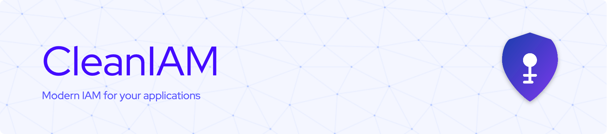
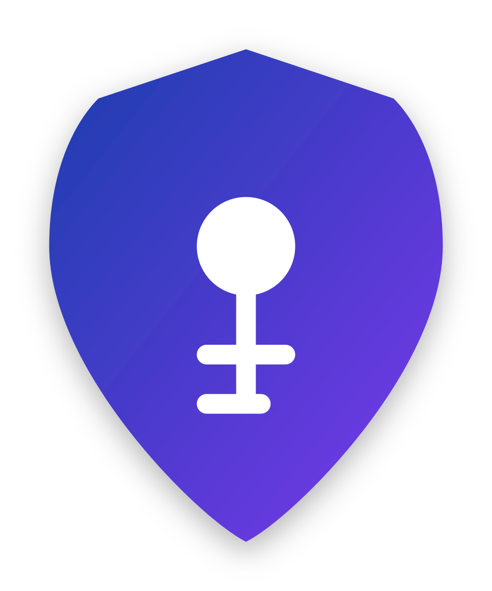

# CleanIAM



A modern, secure, and extensible OpenID Connect server built with clean architecture principles.

[](https://github.com/cleaniam/cleaniam)
[](LICENSE)

## 🌟 Features

- **Robust OIDC Implementation**: Full OpenID Connect protocol support with all standard flows
- **Multi-tenancy**: Built-in support for multi-tenant deployments
- **Vertical Slices Architecture**: Feature-focused organization with domain-driven design principles
- **Modularity**: Extensible architecture for customizing authentication and authorization logic
- **URL Shortener**: Built-in URL shortening service for authorization endpoints
- **Management Portal**: Web-based administration interface
- **Docker Support**: Ready-to-use Docker and docker-compose configurations

## 📖 Documentation

Comprehensive documentation is available at [docs](https://cleaniam.github.io/CleanIAM/)

## 🏗️ Architecture

CleanIAM follows Clean Architecture principles with a Vertical Slices approach, organizing code around business capabilities rather than technical concerns:

- **CleanIAM.Identity**: Vertical slice for identity services and OIDC protocol implementation
- **CleanIAM.Users**: Vertical slice for user management and profile operations
- **CleanIAM.Tenants**: Vertical slice for multi-tenancy capabilities
- **CleanIAM.Scopes**: Vertical slice for OAuth scope definitions and permissions
- **CleanIAM.UrlShortener**: Vertical slice for URL shortening functionality
- **CleanIAM.Applications**: Vertical slice for client application management
- **CleanIAM.Events**: Vertical slice for event-driven communication
- **CleanIAM.SharedKernel**: Cross-cutting concerns and domain primitives

## 🚀 Getting Started

### Prerequisites

- .NET 8.0 SDK or later
- PostgreSQL database
- Node.js and npm (for the Management Portal)
- Docker and docker-compose (optional)

### Installation

#### Using Docker

```bash
# Clone the repository
git clone https://github.com/cleaniam/cleaniam.git
cd cleaniam

# Start using docker-compose
docker build -t cleaniam .
```

#### Manual Setup

```bash
# Clone the repository
git clone https://github.com/cleaniam/cleaniam.git
cd cleaniam

# Restore dependencies
dotnet restore

# Build the solution
dotnet build

# Apply database migrations
cd src/CleanIAM.SharedKernel
dotnet ef database update

# Run the application
cd ../CleanIAM.Host
dotnet run
```

### Frontend Development

[Frontend Repo](https://github.com/CleanIAM/CleanIAM-ManagementPortal)

## 💾 Database

CleanIAM uses PostgreSQL as its primary data store.

You can use the provided Docker Compose file to set up a PostgreSQL instance:

```bash
docker compose -f ./docker-compose-dev.yml up -d
```

### Migrations

- You only need to run the migrations if you updated the OpenIddict schema, since Marten doesn't have to run migrations.

#### Apply a migration

```bash
cd src/CleanIAM.SharedKernel
dotnet ef database update
```

#### Create a migration

- If you update datable schema you can create a migration using the following command:

```bash
cd src/CleanIAM.SharedKernel
dotnet ef migrations add <migration_name>
```

## 🔧 Configuration

Configuration is managed through standard .NET appsettings.json files and environment variables. Key settings include:

- Database connection strings
- OIDC endpoints and signing certificates
- Connection urls for external services
- External identity providers configuration
- SMTP server settings for emails
- Logging preferences

## 🛡️ Security

CleanIAM implements security best practices:

- PKCE flow by default
- JWT token signing with RS256
- Secure cookie handling
- CSRF protection

## 🤝 Contributing

Contributions are welcome! Please feel free to submit a Pull Request.

## 📝 License

This project is licensed under the MIT License - see the LICENSE file for details.

## 🙏 Acknowledgements

- [OpenID Connect](https://openid.net/connect/) and [OAuth 2.0](https://oauth.net/2/) specifications
- [OpenIddict](https://github.com/openiddict/openiddict-core) for the modern OpenID Connect server implementation
- [Marten](https://martendb.io/) for amazing document database
- [Wolverine](https://wolverine.netlify.app/) (WolverineFX) for command handling and message processing

---

<p align="center">
  
</p>
<p align="center">
  Developed as part of a Master's Thesis 2025
</p>
